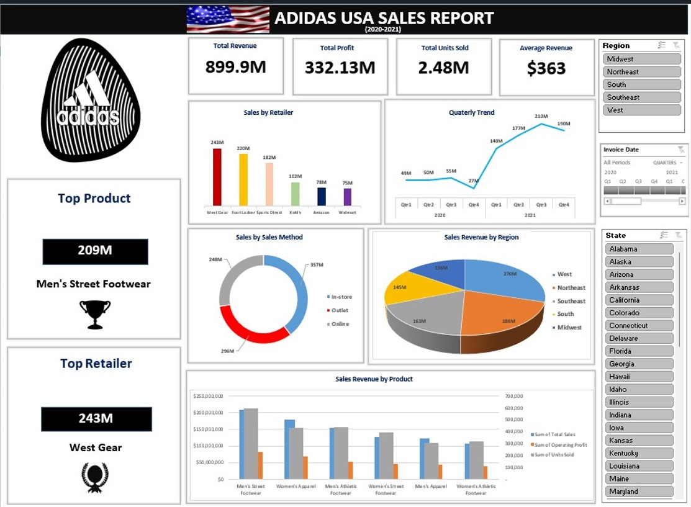

# Adidas US Sales Report using Microsoft Excel

## Introduction
I worked on this project awhile ago, Adidas US sales data for the years 2020-2021, which I downloaded from Kaggle. The dataset didn't have any brief, I made it my mission to uncover valuable insights, trends, track KPIs, sales performance, simplify complex data into actionable information that can be efficiently presented using data visualization using Excel spreadsheet. 
&nbsp;
  
   &nbsp;

## Data Summary  
Adidas sales data provided variety of purposes, such as analyzing sales trends, identifying successful products or marketing campaigns, developing strategies for future sales and to analyze the effectiveness of different marketing or sales channels. This Sales dataset key columns include Retailer, Retailer ID, Invoice Date, Region, State, City, Product, Price per Unit, Units Sold, Total Sales Amount, Operating Cost, New Operating Profit, Operating Margin, and Sales Method.
&nbsp;
  
   &nbsp;

## Key Questions to Explore

📍 **Sales Analysis:**

    Total revenue generated over the period of time

    Total Profit generated over the period of time 

    What is the total unit of product sold? 

    What is the average sale per quality sold?

    What is the performance of sale channels 

📍 **Product Analysis:**

    What is the top product?

    Who is the top retailer?

📍 **Time Series Analysis:**

    Thread In Sales: Daily, Weekly, Quarterly, Monthly and Yearly 

    Yearly Gross Profit

    YoY Sales Growth

📍 **Geographical Analysis:**

     Sales revenue by region and state     
     &nbsp;
  
   &nbsp;

## Conclusion  
The company experienced an impressive increase in revenue and profit in 2021 over the previous year which is positive for business. Details information regarding the purchases made by individual customers were not included in the dataset, which is helpful in conducting customer behavior analysis, that would better provide insight into how to better serve customers and increase revenue. 
&nbsp;
  
   &nbsp;

## Recommendation
The company must use various digital marketing strategies to improve online sales, since it is expected that in the current technological environment, online sales would do better than in-store sales. 
For the upcoming years, the company should continue to adapt and improve on the strategies from 2021 in order to see an increase in growth rate.

